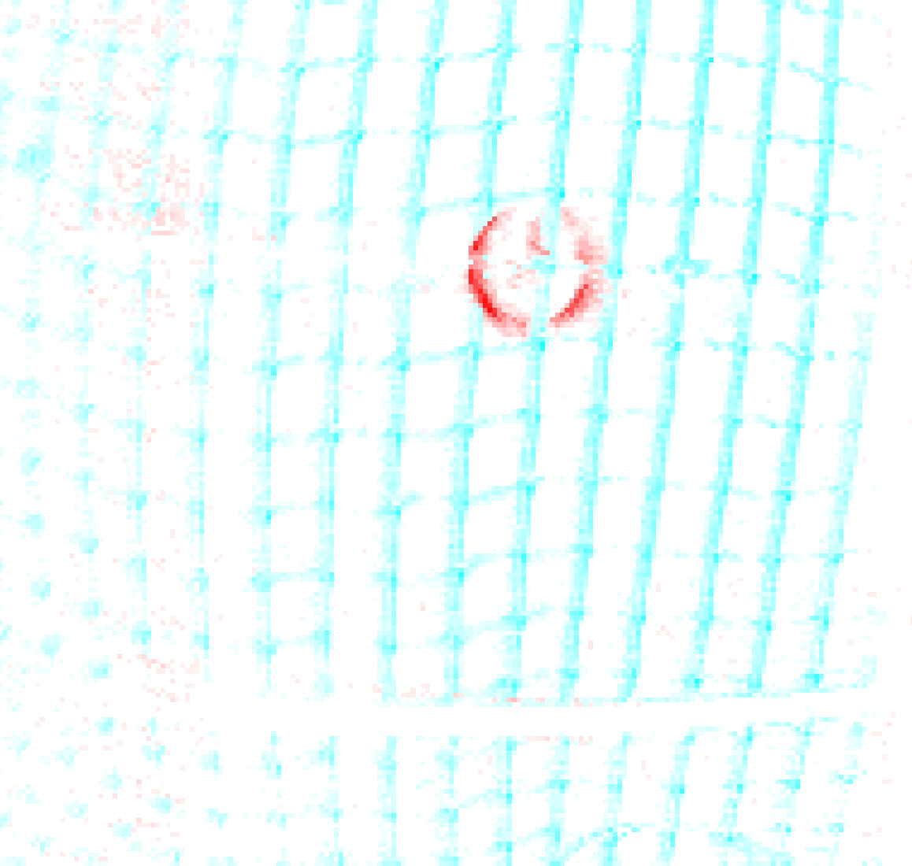
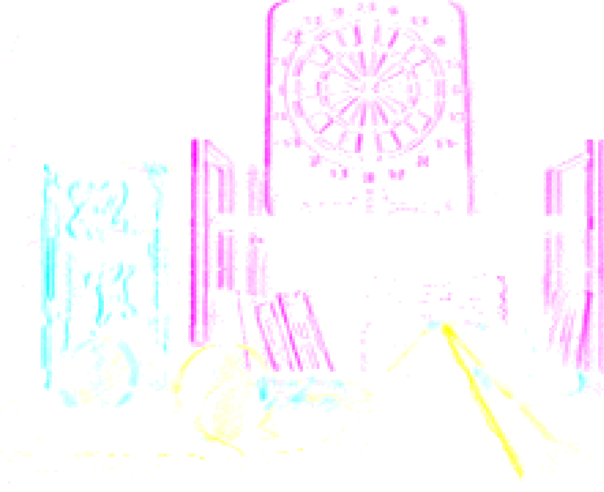
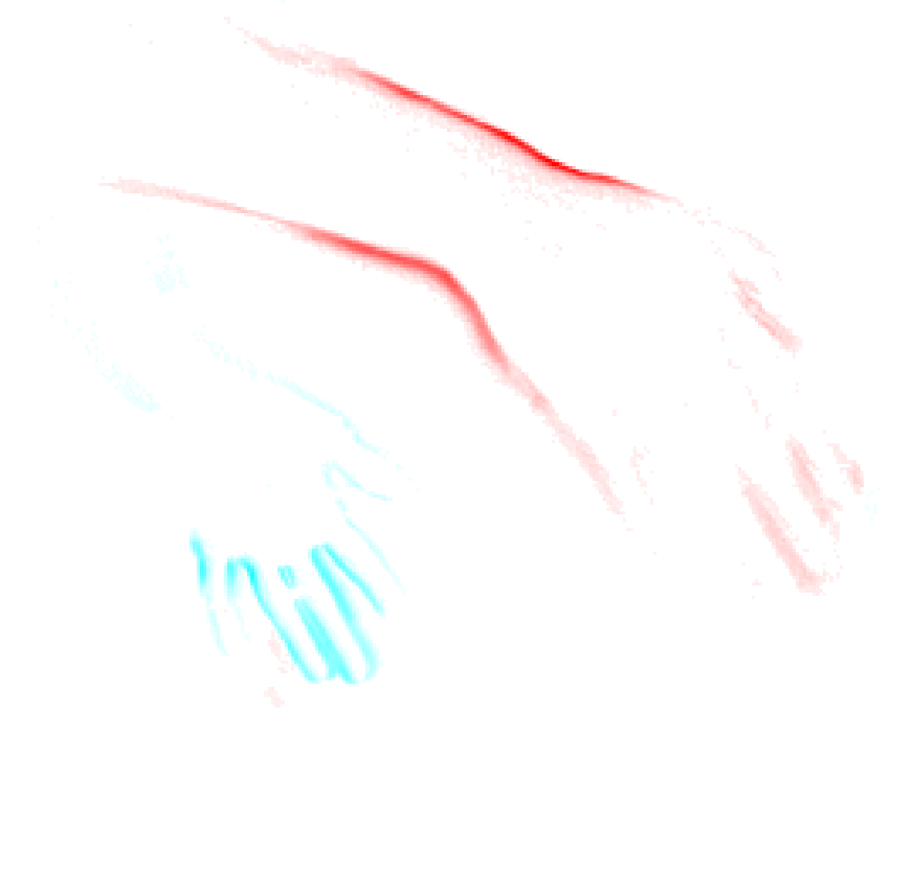
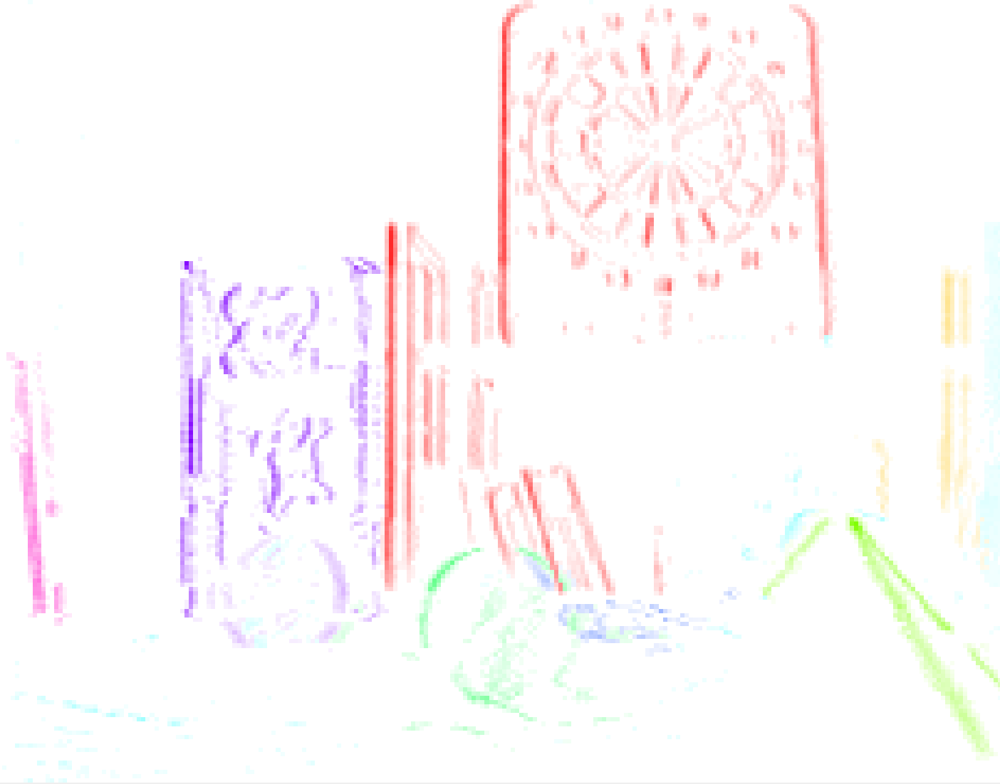

# Event-Vision Motion Segmentation

This ROS package provides an implementation of the paper: **Event-Based Motion Segmentation by Motion Compensation** (Quelle). The goal of this package is not to replicate the paper exactly, but to apply its core ideas in a practical implementation. This package builds upon the [dvs_global_flow] package developed by Professor Guillermo Gallego.

## Table of Contents
- [Event-Vision Motion Segmentation](#event-vision-motion-segmentation)
  - [Table of Contents](#table-of-contents)
  - [Overview](#overview)
  - [Input / Output](#input--output)
    - [Input](#input)
    - [Output](#output)
  - [Parameters](#parameters)
  - [Cluster Initialization](#cluster-initialization)
  - [Known Issues](#known-issues)
  - [Results](#results)
  - [Clustering within Clusters](#clustering-within-clusters)
  - [Results with further Clustering](#results-with-further-clustering)
  - [How to run the code](#how-to-run-the-code)
  - [References](#references)

## Overview

Event-Vision Motion Segmentation involves segmenting motion in visual data captured by event-based cameras. Unlike traditional cameras, event-based cameras provide a stream of events that correspond to changes of light intensity in the scene, which can be processed to detect and segment different motions within the scene. This package implements motion compensation for the different motions in the captured footage to achieve motion segmentation.

## Input / Output

### Input
- **Events:** A stream of events captured by an event-based camera. These events are processed by the package.

### Output
- **Multiple Image Velocities:** A set of 2D vectors representing different velocities in the image.
- **Image of Warped Events:** An image representing warped events sharpened for multiple velocities.

## Parameters

The following parameters can be configured to control the processing of events and clustering:

- **Number of events per sliding window:** The number of events to process together in a "sliding window".
- **Sliding window shift:** The number of events to shift in the sliding window for the next packet of events.
- **Number of motions:** The upper limit on the number of distinct motions detected in the image.
- **Amount of gaussian** smoothing for voting in the IWE (typically 1 pixel).
- **Clustering enabled** Enables clustering the IWE with hdbscan
- **Minimum cluster size:** A tuning parameter for the clustering algorithm [HDBSCAN], representing the minimum size of clusters. The effective `min_cluster_size` is the total number of data points per clustering process divided by the hyperparameter.
- **Pixel displaying and clustering threshold:** Is the threshold with which low value pixels are ignored (for displaying and clustering)
- **Max percentage difference:** The treshold for when similiar motions get fused into a single one

## Cluster Initialization

For initializing the cluster velocities, we initialize a pool of possible motions and evaluate the contrast of the Image of Warped Events (IWE) for each motion. To find the best initial motions, we use a contrast function which only uses non zero pixel and especially rewards higher pixel densities. The motion yielding the highest contrast is selected to initialize a cluster and removed from the pool of motions. Events that positively impact the contrast are then removed for the next iteration of the process. This process ensures that the chosen motions are independent. We repeat this process for all motions.

## Known Issues

Hot pixels can cause problems with the algorithm, especially our visualiziation. To get rid of them we used the ros package [hot pixel filter by cedrick scheerlinck][hot].

The effectiveness of the algorithm, and particularly our implementation, is highly dependent on the initial setup:
- If all motions are not captured in the first frame, the results tend to degrade significantly.
- If too many motions are detected within the video, remaining motions over time tend to converge into one of the existing motions. This can cause flickering in the image, as multiple clusters adopt the same velocity, causing events to frequently swap between clusters. To mitigate this, we manually set a motion to (0,0) if it is too close to another motion to likely be considered independent.
- The hyperparameters significantly impact the result
## Results

<div style="display: flex; justify-content: space-around;">
    
    
    
</div>
As you can see the program works quiet well on the shown images. The first two images were also the ones we used the most while writing the code. Image 3 is a completly new scenario, which we didn't use before. But for which it also work well. Still the result is not always stable as in the beginning the algorithm needs to adjust itself and rapid changes in movement direction or quantity can throw it off.

## Clustering within Clusters

The original paper segments the image based on different motions. However, there can be multiple objects moving with the same velocity. To address this, we experimented with additional clustering within the already segmented motions. To improve performance, we performed clustering not directly on the events, but on the final image.

To evaluate various clustering algorithms, we loaded individual IWEs (with pre-clustered motions) into a Python script and tested multiple algorithms. HDBSCAN emerged as a promising candidate. However, further exploration is needed as clusters are dynamic, leading to unstable results. The used packaing for clustering is the [HDBSCAN] package.

## Results with further Clustering



## How to run the code
  - Install ros (for example [noetic]) and setup your workspace
  - Clone this repository into your catkin workspace (into the src folder):
  
  ```git clone git@github.com:theodorun/event_vision_project.git```
  - Install the dependencies
    - [catkin simple](https://github.com/catkin/catkin_simple)
    - ROS messages for DVS ([rpg_dvs_ros](https://github.com/uzh-rpg/rpg_dvs_ros))
    - [Google Logging Library (glog)](https://github.com/catkin/catkin_simple.git)
    - [Gflags (formerly Google Commandline Flags)](https://github.com/ethz-asl/gflags_catkin)
    - [hdbscan](https://github.com/rohanmohapatra/hdbscan-cpp/tree/master)
  - Build workspace 

    ```catkin build```
  - Download a bag file (for example: [slider_hdr_depth.bag](http://rpg.ifi.uzh.ch/datasets/davis/slider_depth.bag))
  - Update launch file to include correct path for bag file and desired hyperparameters
  - Run in terminal:
  
	```roslaunch dvs_global_flow ijrr_translation.launch```

## References

- dvs_global_flow: https://github.com/tub-rip/dvs_global_flow_skeleton/tree/master
- hot pixel filter: https://github.com/cedric-scheerlinck/dvs_tools/tree/master/dvs_hot_pixel_filter
- HDBSCAN: https://github.com/rohanmohapatra/hdbscan-cpp/tree/master
- noetic: http://wiki.ros.org/noetic/Installation

[dvs_global_flow]: https://github.com/tub-rip/dvs_global_flow_skeleton/tree/master
[hot]: https://github.com/cedric-scheerlinck/dvs_tools/tree/master/dvs_hot_pixel_filter
[HDBSCAN]: https://github.com/rohanmohapatra/hdbscan-cpp/tree/master
[noetic]: http://wiki.ros.org/noetic/Installation


